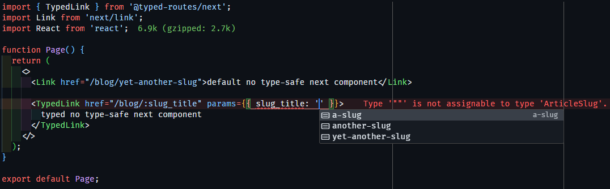

<a name="TOC"></a>

<h3 align="center">
  TYPED ROUTES
</h3>

<div align="center">
  <a href="https://nodejs.org/en/"></a>
  <a href="https://github.com/lucasvtiradentes/typed-routes#contributing"></a>
</div>

<p align="center">
  <a href="#dart-features">Features</a> • <a href="#warning-requirements">Requirements</a> • <a href="#bulb-usage">Usage</a> • <a href="#wrench-development">Development</a> • <a href="#books-about">About</a>
</p>

<a href="#"></a>

## :trumpet: Overview

<div align="center">this is a scoped-package that allows you to define typed routes in React and Next.js applications, ensuring more safety and autocomplete support during the development process.</div><br />

<div align="center">
  
</div>

## :dart: Features <a href="#TOC"></a>

&nbsp;&nbsp;&nbsp;✔️ Define routes with strict typing;<br>
&nbsp;&nbsp;&nbsp;✔️ Supports both [React](./apps/react-test) and [Next.js](./apps/next-test);<br>
&nbsp;&nbsp;&nbsp;✔️ Boosts productivity with route autocompletion;<br>
&nbsp;&nbsp;&nbsp;✔️ Integrates with popular routing libraries.<br>

## :warning: Requirements <a href="#TOC"></a>

- Node.js >= 14
- React >= 17
- Next.js >= 12 (if using Next.js)

## :bulb: Usage <a href="#TOC"></a>

By following these steps, you can ensure type-safe routing in both **React** and **Next.js** using your custom `@typed-routes` package.

### **Usage on React**

1. Install the package

```bash
npm install @typed-routes/react
```

2. Define your routes in a `routes-config.tsx` file.

This file defines the route shapes and configuration for the application. It combines static and dynamic routes for better route management.

```tsx
// routes-config.tsx
import { ReactRouteShape } from '@typed-routes/react';
import { Outlet, RouteObject } from 'react-router-dom';
import { AboutPage, AboutPageSearchParams } from '../pages/about';
import { DashboardPage, DashboardPageSearchParams } from '../pages/dashboard';
import { Layout } from '../pages/layout';
import { HomePage } from '../pages/home';

const privateBaseRoute = '/app' as const;

const privateRoutes = [
  {
    href: `${privateBaseRoute}/dashboard`,
    path: 'dashboard',
    element: <DashboardPage />,
    params: {} as DashboardPageSearchParams
  },
  {
    href: `${privateBaseRoute}/about`,
    path: 'about',
    element: <AboutPage />,
    searchParams: {} as AboutPageSearchParams
  }
] as const satisfies Array<ReactRouteShape>;

export const appRouter = [
  {
    path: privateBaseRoute,
    ErrorBoundary: AboutPage,
    element: (
      <Layout>
        <Outlet />
      </Layout>
    ),
    children: privateRoutes
  },
  {
    path: '/',
    element: <HomePage />
  },
  {
    path: '/*',
    element: <AboutPage />
  }
] as const satisfies RouteObject[];

export const appRoutes = [...privateRoutes] satisfies ReadonlyArray<ReactRouteShape>;
```

3. Set up your router in `router.tsx` using `createBrowserRouter` from `react-router-dom`.

This file sets up the router for a React app using `react-router-dom`.

```tsx
import { createBrowserRouter, RouterProvider } from 'react-router-dom';
import { appRouter, appRoutes } from './routes-config';

export const AppRouter = () => <RouterProvider router={createBrowserRouter(appRouter)} />;

declare module '@typed-routes/react' {
  interface Register {
    allRoutes: typeof appRoutes; // Declares the routes for typed usage
  }
}
```

4. Use the type-safe components instead of the default ones.

This is an example of how to use typed routes with `TypedLink` and `useTypedNavigate` for safe navigation and linking in React.

```tsx
import { TypedLink, useTypedNavigate } from '@typed-routes/react';
import { Link, useNavigate } from 'react-router-dom';

export const HomePage = () => {
  const { typedNavigate } = useTypedNavigate();

  const handleNavigate = () => {
    typedNavigate({ href: '/app/about', searchParams: { date: '' } }, {});
  };

  return (
    <div>
      <button onClick={handleNavigate}>Go to About Page</button>
      <TypedLink href="/app/about" searchParams={{}}>
        Typed About Link
      </TypedLink>
      <TypedLink href="/app/dashboard" params={{ color: 'red', title: 'test' }}>
        Typed Dashboard Link
      </TypedLink>
      <span>Welcome to Home Page</span>
    </div>
  );
};
```

### **Usage on Next.js**

1. Install the package

```bash
npm install @typed-routes/next
```

2. Define static and dynamic routes in `routes-config.ts`.

This file defines the static and dynamic routes for your Next.js app using the `NextRouteShape` type.

```ts
import { NextRouteShape } from '@typed-routes/next';

type ArticleSlug = 'a-slug' | 'another-slug' | 'yet-another-slug';
type PersonNickname = 'john-doe' | 'jane-doe';
type BlogFilters = { tag?: string; author?: PersonNickname };

// Define static routes
export const staticRoutes = [
  { label: 'Home', href: '/' },
  { label: 'Blog', href: '/blog', searchParams: {} as BlogFilters },
  { label: 'Podcast', href: '/podcast' },
  { label: 'Gallery', href: '/personal/gallery' },
  { label: 'Travels', href: '/personal/travels' },
  { label: 'People', href: '/personal/people' },
  { label: 'Projects', href: '/tech/projects' },
  { label: 'Setup', href: '/tech/setup' },
  { label: 'This Site', href: '/tech/this-site' },
  { label: 'Stats', href: '/adm/stats' },
  { label: 'Words', href: '/words' }
] as const satisfies ReadonlyArray<NextRouteShape>;

// Define dynamic routes
export const dynamicRoutes = [
  { label: 'Article', href: '/blog/:slug_title', params: { slug_title: 'a-slug' as ArticleSlug } },
  { label: 'Person', href: '/personal/people/:nickname', params: { nickname: 'john-doe' as PersonNickname } }
] as const satisfies ReadonlyArray<NextRouteShape>;
```

3. Combine and register them in a `routing.ts` for type-safe route navigation.

This file combines the static and dynamic routes and registers them for use in the typed routes system.

```ts
import { NextRouteShape } from '@typed-routes/next';
import { staticRoutes, dynamicRoutes } from './routes-config';

const appRoutes = [...staticRoutes, ...dynamicRoutes] as const satisfies ReadonlyArray<NextRouteShape>;

declare module '@typed-routes/next' {
  interface Register {
    allRoutes: typeof appRoutes; // Register the combined routes for typed usage
  }
}
```

4. Use the type safe componentes instead of the default ones.

```tsx
import { TypedLink } from '@typed-routes/next';
import Link from 'next/link';

function Page() {
  return (
    <>
      <TypedLink href="/blog/:slug_title" params={{ slug_title: 'another-slug' }}>
        Typed Link to Blog
      </TypedLink>
    </>
  );
}

export default Page;
```

## :wrench: Development <a href="#TOC"></a>

To contribute:

1. Clone the repository:

   ```bash
   git clone https://github.com/lucasvtiradentes/typed-routes.git
   ```

2. Install the dependencies:

   ```bash
   npm install
   ```

3. Run the project in development mode:

   ```bash
   npm run dev
   ```

4. Run the tests:
   ```bash
   npm test
   ```

## :books: License

This project is distributed under the MIT License. See the [LICENSE](LICENSE) file for more details.

<a href="#"></a>

<div align="center">
  <p>
    <a target="_blank" href="https://www.linkedin.com/in/lucasvtiradentes/"></a>
    <a target="_blank" href="mailto:lucasvtiradentes@gmail.com"></a>
    <a target="_blank" href="https://discord.com/users/262326726892191744"></a>
    <a target="_blank" href="https://github.com/lucasvtiradentes/"></a>
  </p>
  <p>Made with ❤️ by <strong>Lucas Vieira</strong></p>
</div>
