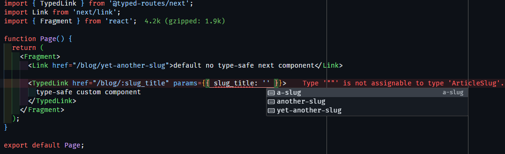

<a name="TOC"></a>

<h3 align="center">
  TYPED ROUTES
</h3>

<div align="center">
  <a href="https://nodejs.org/en/"></a>
  <a href="https://github.com/lucasvtiradentes/typed-routes#contributing"></a>
</div>

<p align="center">
  <a href="#dart-features">Features</a> • <a href="#bulb-usage">Usage</a> • <a href="#wrench-development">Development</a>
</p>

<a href="#"></a>

## :trumpet: Overview

<div align="center">a package that allows you to define typed routes in React and Next.js applications, ensuring more safety and autocomplete support during the development process.</div><br />

<div align="center">
  
</div>

## :question: Motivation

My primary motivation for developing this tool was to ensure that I can have type-safe routing in both React and Next.js applications default choices with minimum effort. That means, even though I know there is [@tanstack/router](https://tanstack.com/router/latest), it is simpler to just use a light package instead of change my entire codebase to use it.

## :dart: Features <a href="#TOC"></a>

&nbsp;&nbsp;&nbsp;✔️ Navegate through routes with strict typing and autocompletion;<br>
&nbsp;&nbsp;&nbsp;✔️ Supports both React and Next.js, you can check the [examples folder](./examples/);<br>
&nbsp;&nbsp;&nbsp;✔️ Provides ready-to-use type-safe custom components and hooks (Link, NavLink, Navigate, useNavigate).<br>

## :bulb: Usage <a href="#TOC"></a>

<div align="center">
<details>
  <summary>How to use it on React?</summary>
  <div align="left">
    <br>
    <div>1. Install the package</div><br />

```bash
npm install @typed-routes/react
```

  <div>2. Define your routes in a `routes-config.tsx` file.</div><br />
  <div>This file defines the route shapes and configuration for the application. It combines static and dynamic routes for better route management.</div>

```tsx
import { ReactRouteShape } from '@typed-routes/react';
import { Outlet, RouteObject } from 'react-router-dom';
import { AboutPage, AboutPageSearchParams } from '../pages/about';
import { DashboardPage, DashboardPageSearchParams } from '../pages/dashboard';
import { Layout } from '../pages/layout';
import { HomePage } from '../pages/home';

const privateBaseRoute = '/app' as const;

const privateRoutes = [
  {
    href: `${privateBaseRoute}/dashboard`,
    path: 'dashboard',
    element: <DashboardPage />,
    params: {} as DashboardPageSearchParams
  },
  {
    href: `${privateBaseRoute}/about`,
    path: 'about',
    element: <AboutPage />,
    searchParams: {} as AboutPageSearchParams
  }
] as const satisfies Array<ReactRouteShape>;

export const appRouter = [
  {
    path: privateBaseRoute,
    ErrorBoundary: AboutPage,
    element: (
      <Layout>
        <Outlet />
      </Layout>
    ),
    children: privateRoutes
  },
  {
    path: '/',
    element: <HomePage />
  },
  {
    path: '/*',
    element: <AboutPage />
  }
] as const satisfies RouteObject[];

export const appRoutes = [...privateRoutes] satisfies ReadonlyArray<ReactRouteShape>;
```

  <div>3. Set up your router in `setup-autocompletion.tsx`.</div><br />
  <div>This file sets up the router for a React app using `react-router-dom`.</div>

```tsx
import { appRoutes } from './routes-config';

declare module '@typed-routes/react' {
  interface Register {
    allRoutes: typeof appRoutes; // Declares the routes for typed usage
  }
}
```

<div>4. Make sure to create a `router-provider.tsx` to import in your root component.</div><br />

```tsx
import { createBrowserRouter, RouterProvider } from 'react-router-dom';

import { appRouter } from './router-configs';

export const AppRouter = () => <RouterProvider router={createBrowserRouter(appRouter)} />;
```

<div>5. Use the type safe componentes instead of the default ones.</div><br />

```tsx
import { TypedLink } from '@typed-routes/react';

function Page() {
  return (
    <TypedLink href="/app/dashboard" params={{ color: 'red', title: 'test' }}>
      Dashboard
    </TypedLink>
  );
}

export default Page;
```

  </div>
</details>
</div>

<br />

<div align="center">
<details>
  <summary>How to use it on Next.js?</summary>
  <div align="left">
    <br>

<div>1. Install the package</div><br />

```bash
npm install @typed-routes/next
```

<div>2. Define static and dynamic routes in `route-configs.ts`.</div><br />
<div>This file defines the static and dynamic routes for your Next.js app using the `NextRouteShape` type.</div>

```ts
import { NextRouteShape } from '@typed-routes/next';

type ArticleSlug = 'a-slug' | 'another-slug' | 'yet-another-slug';
type PersonNickname = 'john-doe' | 'jane-doe';
type BlogFilters = { tag?: string; author?: PersonNickname };

export const staticRoutes = [
  { label: 'Home', href: '/' },
  { label: 'Blog', href: '/blog', searchParams: {} as BlogFilters },
  { label: 'Podcast', href: '/podcast' },
  { label: 'Gallery', href: '/personal/gallery' },
  { label: 'Travels', href: '/personal/travels' },
  { label: 'People', href: '/personal/people' },
  { label: 'Projects', href: '/tech/projects' },
  { label: 'Setup', href: '/tech/setup' },
  { label: 'This Site', href: '/tech/this-site' },
  { label: 'Stats', href: '/adm/stats' },
  { label: 'Words', href: '/words' }
] as const satisfies ReadonlyArray<NextRouteShape>;

export const dynamicRoutes = [
  { label: 'Article', href: '/blog/:slug_title', params: { slug_title: 'a-slug' as ArticleSlug } },
  { label: 'Person', href: '/personal/people/:nickname', params: { nickname: 'john-doe' as PersonNickname } }
] as const satisfies ReadonlyArray<NextRouteShape>;

export const appRoutes = [...staticRoutes, ...dynamicRoutes] as const satisfies ReadonlyArray<NextRouteShape>;
```

<div>3. Combine and register them in a `setup-autocompletion.ts` for type-safe route navigation.</div><br />

<div>This file registers the routes for use in the typed routes system.</div>

```ts
import { NextRouteShape } from '@typed-routes/next';
import { appRoutes } from './route-configs';

declare module '@typed-routes/next' {
  interface Register {
    allRoutes: typeof appRoutes; // Register the combined routes for typed usage
  }
}
```

<div>4. Use the type safe componentes instead of the default ones.</div><br />

```tsx
import { TypedLink } from '@typed-routes/next';

function Page() {
  return (
    <TypedLink href="/blog/:slug_title" params={{ slug_title: 'another-slug' }}>
      Typed Link to Blog
    </TypedLink>
  );
}

export default Page;
```

  </div>
</details>
</div>

## :wrench: Development <a href="#TOC"></a>

To contribute:

1. Clone the repository:

   ```bash
   git clone https://github.com/lucasvtiradentes/typed-routes.git
   ```

2. Install the dependencies:

   ```bash
   npm install
   ```

3. Run the project in development mode:

   ```bash
   npm run dev
   ```

<a href="#"></a>

<div align="center">
  <p>
    <a target="_blank" href="https://www.linkedin.com/in/lucasvtiradentes/"></a>
    <a target="_blank" href="mailto:lucasvtiradentes@gmail.com"></a>
    <a target="_blank" href="https://discord.com/users/262326726892191744"></a>
    <a target="_blank" href="https://github.com/lucasvtiradentes/"></a>
  </p>
  <p>Made with ❤️ by <strong>Lucas Vieira</strong></p>
</div>
